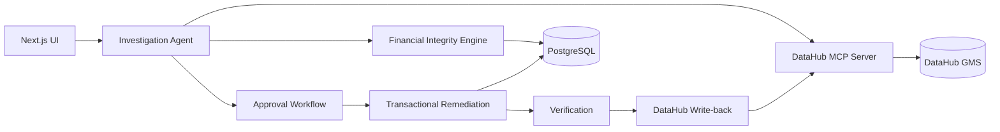
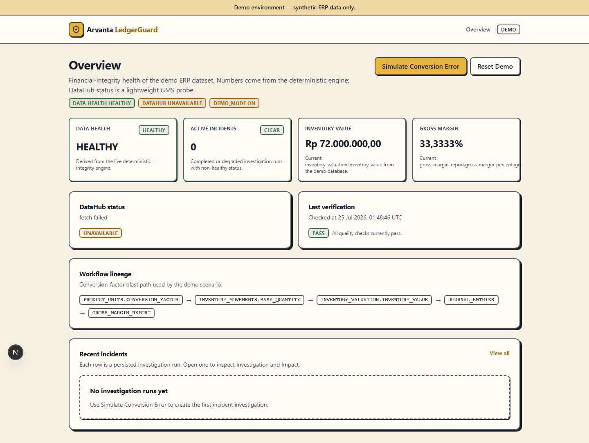
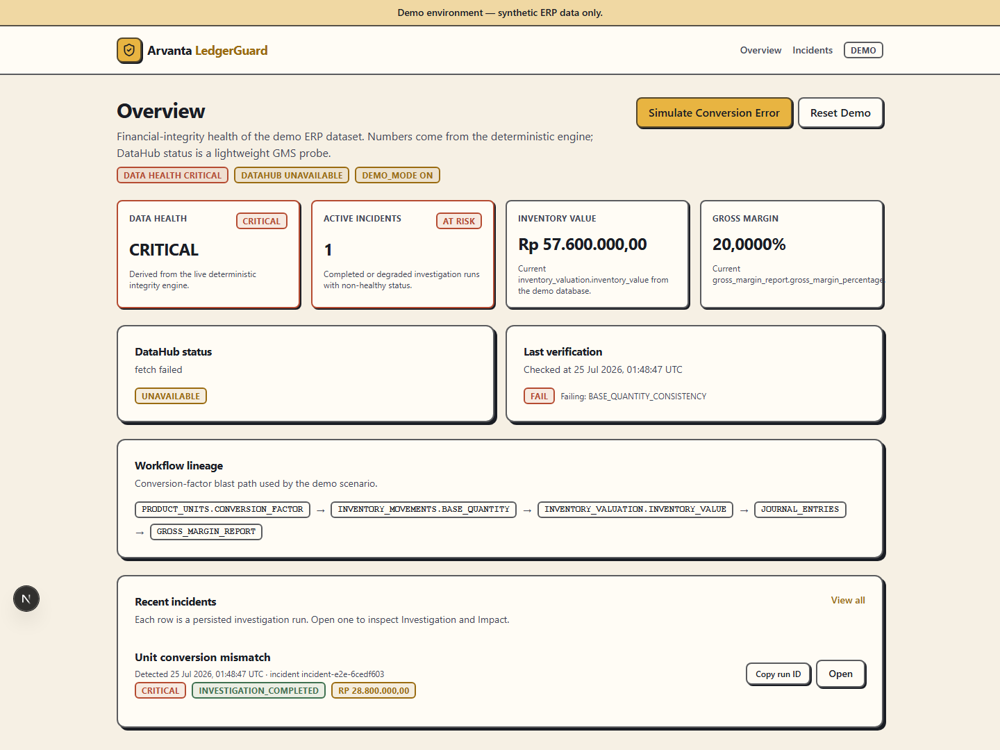
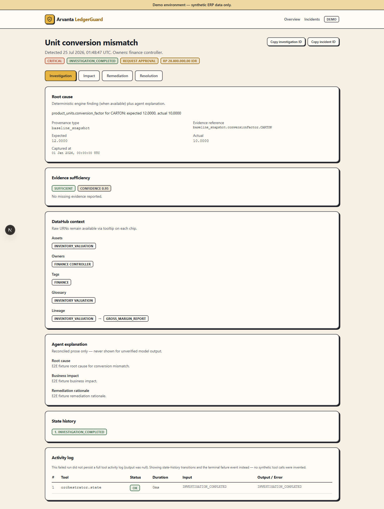
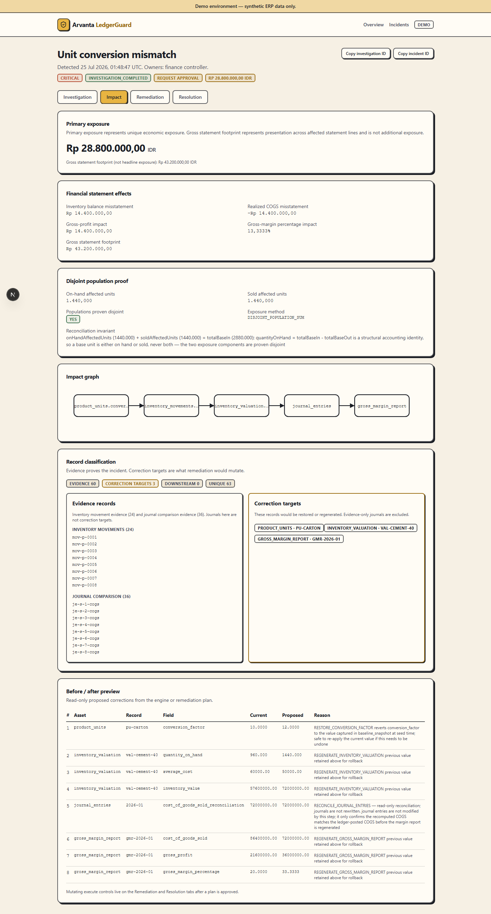
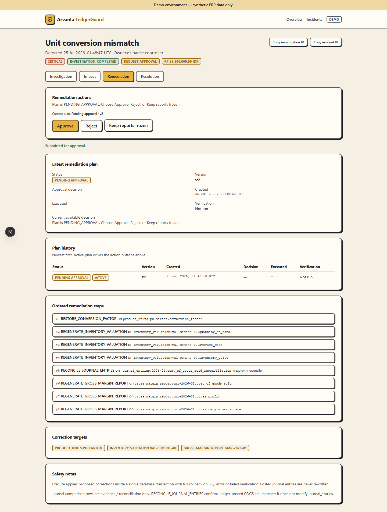
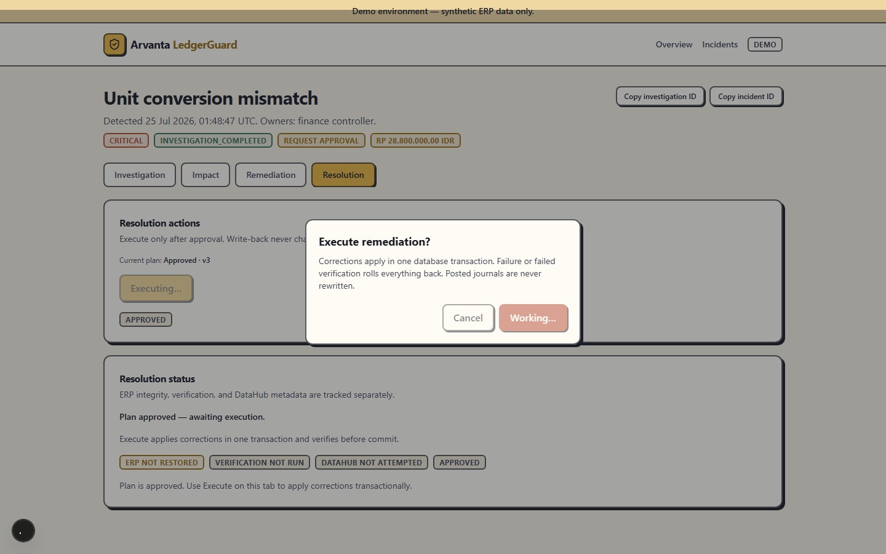
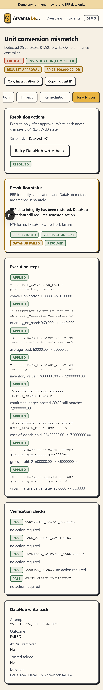

# Arvanta LedgerGuard

A DataHub-powered financial integrity agent that detects ERP data failures, traces their downstream impact, and executes human-approved remediation.

## Problem

A single wrong unit-conversion factor — for example `1 CARTON = 12 PCS` silently
changed to `1 CARTON = 10 PCS` — corrupts inventory valuation at the source. From
there the error cascades automatically and invisibly: every inventory movement
recorded against that unit is now valued wrong, the cost-of-goods-sold figure
derived from those movements is wrong, the journal entries that post COGS are
wrong, and the gross-margin report built on top of all of it is wrong.

A typical ERP will show you the *wrong number* — a margin that doesn't reconcile,
a valuation that looks off — but it will not tell you *why*, which records are
actually affected, how far the error has spread, or how much money is at stake.
Someone has to manually trace the chain backwards, by hand, under time pressure,
usually after the damage has already been reported to stakeholders.

## Solution

LedgerGuard automates that trace, end to end, with a human approval gate before
anything is changed:

**Detect** → **Investigate with DataHub context** → **Quantify deterministic
financial exposure** → **Generate a remediation plan** → **Human approval** →
**Transactional execution** → **Verification** → **DataHub write-back**

1. **Detect** — a data-quality signal (here, a conversion-factor mismatch against
   its baseline) triggers an incident.
2. **Investigate with DataHub context** — the agent reads the affected dataset's
   schema, ownership, glossary terms, tags, and lineage graph from DataHub (via
   the DataHub MCP Server) to understand what the data *means* and what else it
   feeds, then explains the root cause in plain language.
3. **Quantify deterministic financial exposure** — a pure, LLM-free TypeScript
   engine walks the real inventory movements and journal entries and computes
   the exact blast radius and financial exposure. The LLM never computes a
   number.
4. **Generate a remediation plan** — the engine proposes an ordered, reversible
   set of corrections (which tables, which records, which fields, before/after
   values).
5. **Human approval** — nothing is written to the database until a human
   reviews and approves the plan.
6. **Transactional execution** — the approved plan runs inside a single
   database transaction; any failure rolls back cleanly.
7. **Verification** — post-execution checks confirm the correction actually
   restored integrity before the incident is allowed to close.
8. **DataHub write-back** — the investigation, resolution, and updated trust
   status are written back to DataHub so the dataset's catalog entry reflects
   reality.

## Why DataHub

LedgerGuard does not use DataHub as a passive catalog it occasionally reads
from. DataHub is the agent's actual context source and its system of record for
data-quality status:

- **Schema, ownership, glossary, tags** — read through MCP so the agent knows
  who owns the affected dataset, what business term the field maps to (e.g. the
  `UnitConversion` glossary term), and whether it's already tagged
  `Finance Critical` or `At Risk`.
- **Lineage** — read to compute which downstream datasets (`inventory_movements`
  → `inventory_valuation` → `journal_entries` → `gross_margin_report`) are in
  the blast radius, instead of the agent having to hard-code that knowledge.
- **Assertions / quality signals** — read as part of the evidence the agent
  reconciles against before trusting its own explanation.
- **MCP reads and MCP mutations** — the agent both reads context through the
  DataHub MCP Server and mutates it: it tags the affected dataset `At Risk`
  with an explanatory note the moment it opens an investigation.
- **Resolution write-back** — once a remediation is verified, the agent writes
  the resolution back to DataHub (restoring `Trusted`, replacing the `At Risk`
  note), so DataHub's own metadata reflects the dataset's real, current
  trustworthiness — not just what happened in LedgerGuard's own database.

## Demo scenario

The bundled demo scenario changes `product_units` so that unit `CARTON` reports
`conversion_factor = 10` instead of its correct baseline value of `12`
(`1 CARTON = 12 PCS`, wrongly recorded as `1 CARTON = 10 PCS`).

Numbers below come from a real run of the deterministic engine, captured in
[`examples/investigations/conversion-error-investigation.json`](examples/investigations/conversion-error-investigation.json) —
they are not invented for this README:

- Root cause: `product_units.conversion_factor` for `CARTON`, expected `12.0000`,
  actual `10.0000` (delta `-2.0000`).
- Blast radius: 24 inventory-movement records, 1 inventory valuation, 36 journal
  entries, 1 gross-margin report.
- Financial exposure: primary exposure **Rp 28,800,000**, gross statement
  footprint **Rp 43,200,000** (synthetic demo currency/data, computed by
  disjoint-population summation over on-hand vs. sold affected units).
- Remediation plan: 4 correction targets across `product_units`,
  `inventory_valuation`, `journal_entries`, and `gross_margin_report`.

## Architecture



- **UI (Next.js)** — triggers investigations, displays evidence, and is the
  only place a human can approve or reject a remediation plan.
- **Investigation Agent** — orchestrates the flow above; the only component
  that calls the LLM, and only for explanation/planning, never for numbers.
- **DataHub MCP Server / GMS** — metadata, lineage, and quality-signal source;
  also the write-back target for investigation and resolution status.
- **Financial Integrity Engine** — pure, deterministic TypeScript; the single
  source of truth for every number.
- **Approval Workflow** — the human-in-the-loop gate; a plan cannot execute
  without an explicit approval record.
- **Transactional Remediation** — applies the approved plan to PostgreSQL
  inside one transaction, with rollback on any failure.
- **Verification** — re-checks integrity after execution before the incident
  can be marked resolved.

## Safety model

- The LLM **explains and orchestrates**; it never computes a financial number
  and never writes directly to the database. Every number in this system comes
  from the deterministic engine in `src/engine/`.
- Nothing is changed without **human approval** — the remediation plan is
  generated, then must be explicitly approved before execution.
- Approval uses **optimistic concurrency**: an approval is rejected if the
  underlying plan changed since it was reviewed, instead of silently applying
  a stale decision.
- Execution is **transactional**: the full correction set commits or rolls
  back as one unit — there is no partially-applied state.
- The incident is only marked **resolved** after **post-execution
  verification** independently confirms the correction, not merely because
  execution didn't throw.
- A **DataHub write-back failure does not cancel or roll back an
  already-verified ERP remediation** — the ERP-side fix stands. It marks the
  dataset's DataHub metadata as stale/pending instead, so the discrepancy
  between "ERP is fixed" and "DataHub hasn't heard yet" is visible rather than
  silently swallowed.

## Screenshots

Selected from the full UI audit in [`docs/ui-audit/screenshots/`](docs/ui-audit/screenshots/):

| Healthy overview | At-risk overview |
|---|---|
|  |  |

| Investigation | Impact |
|---|---|
|  |  |

| Pending approval | Resolved |
|---|---|
|  |  |

Mobile: 

## Tech stack

Next.js 15 (App Router) · React 18 · TypeScript · Tailwind CSS · Drizzle ORM ·
PostgreSQL · Zod · DataHub OSS · DataHub MCP (`mcp-server-datahub`) ·
`@anthropic-ai/sdk` · Vitest · Playwright · Docker.

## Local quickstart

### 1. Prerequisites

- Node.js ≥ 20
- Python 3.11+ (3.13 has been verified working; DataHub itself recommends 3.11
  and prints a non-blocking warning on newer versions)
- Docker (for PostgreSQL and DataHub OSS quickstart)

### 2. Install

```bash
npm install
```

### 3. Environment

```bash
cp .env.example .env
```

Fill in values as needed — see [Environment variables](#environment-variables)
below. The defaults work for a fully local demo.

### 4. Postgres

```bash
npm run db:up             # start demo PostgreSQL (Docker) on host port 5433
npm run db:wait           # block until Postgres accepts connections
npm run db:migrate        # apply committed SQL migrations from ./drizzle
npm run db:seed           # load deterministic healthy baseline
```

(`npm run db:setup` runs all four in sequence.)

### 5. DataHub

```bash
python -m venv .venv
./.venv/Scripts/pip install -r src/datahub/requirements.txt   # Windows
./.venv/bin/pip install -r src/datahub/requirements.txt       # macOS / Linux

npm run datahub:up          # start DataHub OSS via the official quickstart
npm run datahub:status      # health check
```

DataHub OSS quickstart needs roughly **8 GB RAM and 13 GB of disk**. GMS listens
on `localhost:8080`, the DataHub frontend on `localhost:9002`. Never expose GMS
to the public internet without authentication.

### 6. Bootstrap metadata

```bash
npm run datahub:bootstrap   # provision datasets, lineage, owners, glossary, tags
```

Idempotent — safe to re-run; every write is an upsert against a stable URN.

### 7. Start the app

```bash
npm run dev                 # http://localhost:3000
```

If port 3000 is already in use, Next.js will pick the next free port and print
it — check the terminal output for the actual URL.

### 8. Run the demo

```bash
npm run scenario:conversion-error   # apply the unit-conversion error scenario
```

Then walk through the flow in the UI: Overview → Simulate → Investigate →
Impact → Generate remediation → Approve → Execute → Verify → DataHub
write-back. See [`docs/ui/ledgerguard-demo-flow.md`](docs/ui/ledgerguard-demo-flow.md)
for the exact route-by-route script.

```bash
npm run db:reset             # back to the healthy baseline afterwards
```

### 9. Tests

```bash
npm run typecheck
npm run lint
npm run test               # unit tests — no database required
npm run test:integration   # requires a running, migrated, seeded database
npm run test:datahub       # requires a running DataHub OSS + MCP server
npm run test:agent         # agent unit + live orchestrator/model tests
npm run test:e2e           # Playwright full incident lifecycle
npm run build
```

### 10. Cleanup

```bash
npm run db:down             # stop Postgres (keeps the data volume)
npm run datahub:down        # stop DataHub (data is preserved)
```

Use `npm run db:nuke` only if you want to delete the demo database's data
volume entirely.

## Environment variables

See [`.env.example`](.env.example) for the full, commented list, split into
**required** (`DEMO_MODE`, `DATABASE_URL`) and **optional** (DataHub connection,
model provider) sections. No real values are shown here or in the file itself —
only variable names and explanations.

### Runtime modes

Local UI development can keep the deterministic narrator and the clearly marked
static context fallback available when DataHub is offline:

```env
JUDGE_MODE=false
ALLOW_DEMO_FALLBACK=true
REQUIRE_LIVE_MODEL=false
```

Judging is fail-closed: the investigation must read context through live
DataHub MCP, and a missing MCP connection, dataset, lineage, or MCP write-back
is a visible failure rather than a completed incident. The UI persists and
shows whether context came from `LIVE_MCP` or `STATIC_DEMO_CONTEXT`, and whether
narration came from Anthropic, OpenAI, or the deterministic template. The LLM
only writes narrative/recommendation text — every financial figure still comes
from the deterministic engine.

`LLM_PROVIDER` selects the narrator (`anthropic`, `openai`, or `deterministic`).
OpenAI and Anthropic are both supported live providers; the deterministic
template is the offline/development fallback and cannot satisfy
`REQUIRE_LIVE_MODEL=true`.

Judging with OpenAI:

```env
DEMO_MODE=true
JUDGE_MODE=true
ALLOW_DEMO_FALLBACK=false
REQUIRE_LIVE_MODEL=true
LLM_PROVIDER=openai
OPENAI_API_KEY=...
DATAHUB_GMS_URL=...
```

Judging with Anthropic:

```env
DEMO_MODE=true
JUDGE_MODE=true
ALLOW_DEMO_FALLBACK=false
REQUIRE_LIVE_MODEL=true
LLM_PROVIDER=anthropic
ANTHROPIC_API_KEY=...
DATAHUB_GMS_URL=...
```

Before a judging session, run `npm run judge:preflight`. It checks the isolated
demo PostgreSQL schema, DataHub MCP reads/lineage, mutation tools with a safe
restore, and the live-model requirement for the configured provider. Then run
`npm run proof:judge-flow` to reset only the synthetic demo database and produce
sanitized artifacts in `examples/judge-proof/`. The command does not manufacture
a success artifact: it exits non-zero if any live step fails.

## Test coverage

- **Unit** — `npm run test` (engine, agent, UI logic; no external services).
- **Integration** — `npm run test:integration` (engine + repositories against a
  real, migrated, seeded PostgreSQL instance).
- **DataHub MCP** — `npm run test:datahub` (live reads, live tag/write-back
  mutations, and idempotent restore against a real DataHub OSS instance).
- **Agent** — `npm run test:agent` (orchestrator state machine, live
  investigation run, live model smoke test).
- **UI / E2E** — `npm run test:e2e` (Playwright, full incident lifecycle in the
  browser).
- **Remediation flow** — covered by the FASE 6 unit + live integration suite
  (plan generation, approval concurrency, transactional execution, rollback,
  verification, write-back).

As of the last verified run on this branch: unit 73/73, integration 20/20,
DataHub MCP 45/46 (1 intentionally skipped — see below), agent 17/18 (same
skip), E2E 20/20 (16 additional cases are intentionally scoped to the desktop
project only and skipped on tablet/mobile). The one skipped case in both the
DataHub MCP and agent suites is the live model smoke test, which only runs
when `RUN_LIVE_MODEL_TEST=true` and the active `LLM_PROVIDER` credential is
configured. These counts will drift as the suite grows — run the commands
above for current numbers.

## Repository structure

```
app/                Next.js routes and server actions (UI + agent triggers)
src/engine/         Deterministic financial integrity engine (FASE 4)
src/agent/          DataHub-aware investigation agent (FASE 5)
src/datahub/        Python bootstrap + MCP proof/write-back tooling
src/db/             Drizzle schema, migrations, repositories, seed/reset
drizzle/            Versioned SQL migrations
demo-data/          Seed data and the conversion-error scenario script
examples/           Real captured artifacts (investigation, remediation, MCP)
tests/              Unit, integration, DataHub, and agent test suites
docs/               Architecture, contracts, UI flow, deployment, submission
docker-compose.yml  Demo PostgreSQL only (DataHub is provisioned separately)
```

## Current limitations

- The demo dataset is **synthetic**, built for one clear scenario
  (unit-conversion error); it is not a general-purpose data-quality product.
- The deployment described here is **hackathon-grade**: a single demo VM, no
  horizontal scaling, no multi-tenant isolation.
- **DataHub OSS** is resource-heavy (~8 GB RAM, ~13 GB disk) — this is a
  property of DataHub's own quickstart, not something LedgerGuard can reduce.
- The **live model-provider smoke test** is opt-in (`RUN_LIVE_MODEL_TEST=true`)
  and skipped without the active provider API key (Anthropic or OpenAI);
  the deterministic template narrator is the offline fallback. Unit tests mock
  OpenAI/Anthropic SDKs and do not prove a live provider call.
- LedgerGuard is **not a substitute for audit or accounting review** — it
  surfaces and helps remediate a specific class of data-integrity error; it
  does not certify financial statements.
- LedgerGuard is **not a production ERP migration or data-repair tool** — it
  operates on its own synthetic demo schema and database, not on live ERP
  systems.

## Hackathon

Built for **Build with DataHub: The Agent Hackathon**. This repository does not
claim any award, placement, or endorsement.

## License

Apache License 2.0 — see [LICENSE](./LICENSE).

---

> **Disclosure:** Arvanta is an existing proprietary ERP product. Arvanta
> LedgerGuard is a new, standalone hackathon project created during the
> competition period. This repository contains only the newly developed
> DataHub integration, agent workflow, financial-integrity engine, remediation
> flow, demo interface, and synthetic sample data — the existing Arvanta ERP
> codebase is not included in this submission.
