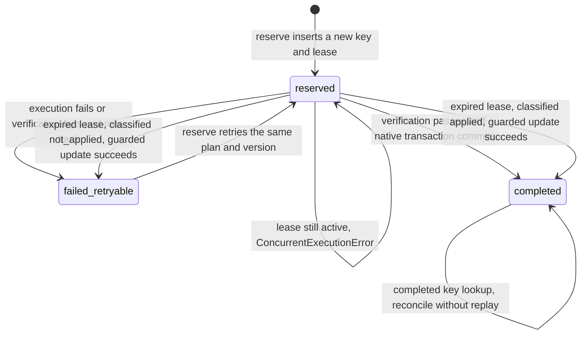
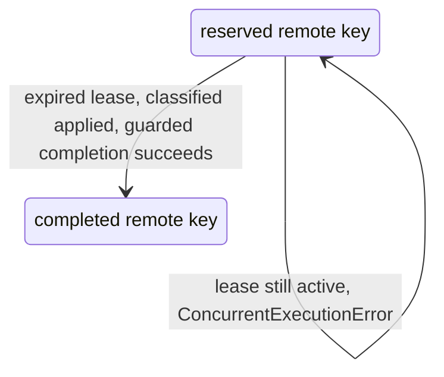

# Execution key states

This diagram tracks the persisted execution **key**, not the plan or an
`ExecutionReceipt` status. The key has only three states: `reserved`, `completed`
and `failed_retryable`. In particular, `RECOVERY_REQUIRED`, `ALREADY_EXECUTED`
and `in_flight` are outcomes, not additional key states.

## Native PostgreSQL execution and recovery

The same immutable plan ID/version must own the key. An ownership conflict is
rejected before interpreting its state; it is not a retry transition.

- **Normal commit:** `execute.ts` supplies `beforeCommit`, which completes the
  key, appends the journal and updates the plan on the same transaction client
  as the verified mutations. The `completed` state becomes durable only when
  that transaction commits. A failure rolls back that completion; the failure
  path calls `failRetryable` on the reserved key.
- **Lease expiry does not itself change a key.** The default lease is 60 seconds.
  `isLeaseExpired` uses the deadline, or the creation time plus that default for
  a legacy record. If neither timestamp is usable, expiry is not established.
- **`not_applied`:** fresh investigation still proposes the approved corrections.
  Recovery marks the key `failed_retryable`. An executing/verifying plan becomes
  `INTERRUPTED`; an already `APPROVED` plan is kept approved while the returned
  outcome is `INTERRUPTED`. A later eligible call can reserve again; recovery
  itself does not immediately re-execute.
- **`applied`:** verification is PASS, every declared expectation holds, and the
  approved after-values checked by `approvedCorrectionsApplied` are present.
  That helper skips `RECONCILE_JOURNAL_ENTRIES` corrections; it does not perform
  an after-value comparison for them. Recovery completes the key and reconciles
  the plan to `RESOLVED`, returning `ALREADY_EXECUTED` instead of replaying writes.
- **`ambiguous`:** neither condition is established, including a disappeared
  incident with failed postconditions. The key stays reserved; the result is
  `RECOVERY_REQUIRED`.

Recovery updates also compare the reservation's owner, creation time and lease
deadline. If another worker renewed or changed the reservation, the guarded
update does not take the stale transition: the store re-reads the key and can
return `in_flight`, leading to `ConcurrentExecutionError`, or report the state
another worker already reached. Completion is not proof that later plan
reconciliation cannot need recovery.

## Remote actions: an expired lease is not cancellation

`recoverRemoteReserved` can finish an **applied** action. For `not_applied` or
`ambiguous`, it preserves the reservation: a delayed remote request could still
commit after the observation. It does not automatically release the key or
retry the mutation. Thus the expiry rule is not "every remote expired lease
remains reserved"; proven application can complete it. This diagram covers
lease recovery only, not every normal remote execution/failure path. A remote
post-write verification failure is not evidence of a PostgreSQL rollback.

## Code behind the arrows

- [Key store and guarded updates](../../packages/postgres/src/execution-keys.ts)
- [Classification](../../packages/core/src/lifecycle/classify-stale-reservation.ts)
  and [classification tests](../../packages/core/test/classify-stale-reservation.test.ts)
- [Native execution gates and commit/failure paths](../../src/remediation/execute.ts)
- [Native recovery](../../src/remediation/recover-execution.ts)
- [Remote recovery](../../src/remediation/execute-remote-action.ts)

These diagrams describe current code, not exactly-once delivery or production
readiness. See [execution integrity](execution-integrity.md) for the broader
plan/receipt lifecycle and adapter limits.
