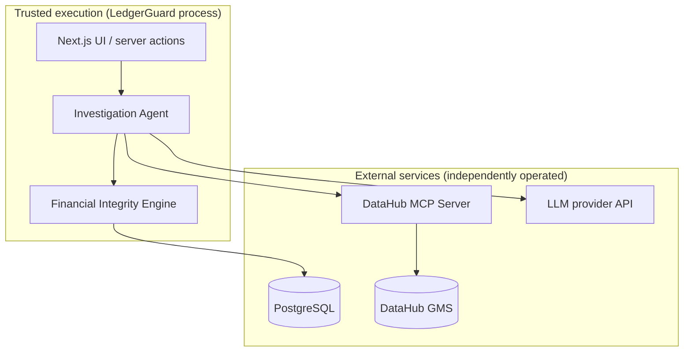

# Architecture overview

This is the system-level map of LedgerGuard. For module-level detail see:

- [`financial-integrity-engine.md`](financial-integrity-engine.md) — the
  deterministic engine (FASE 4)
- [`trust-boundary.md`](trust-boundary.md) — DataHub sits outside execution authority
- [`investigation-agent.md`](investigation-agent.md) — the DataHub-aware agent
  (FASE 5)
- [`ledgerguard-agent-api.md`](../contracts/ledgerguard-agent-api.md) — the
  data contract the UI is built against
- [`ledgerguard-demo-flow.md`](../ui/ledgerguard-demo-flow.md) — the
  route-by-route demo script
- [`../deployment.md`](../deployment.md) — how to run this outside a
  developer's machine

## 1. Components

| Component | Language/runtime | Responsibility |
|---|---|---|
| UI | Next.js 15 (App Router), React 18 | Displays evidence, incident state, and is the only surface where a human can approve/reject a remediation plan |
| Financial Integrity Engine | Pure TypeScript (`src/engine/`) | Computes every number: blast radius, financial exposure, remediation plan, execution, verification |
| Investigation Agent | TypeScript orchestrator + LLM (`src/agent/`) | Plans the investigation, calls DataHub MCP tools, summarises evidence, explains root cause — produces structured, schema-validated output only |
| DataHub OSS (GMS + MCP server) | Java/Python services (external, self-hosted) | System of record for schema, ownership, glossary, tags, lineage, and quality/trust status |
| PostgreSQL | Managed by Drizzle ORM | Synthetic demo ERP data; remediation runs inside a transaction |

## 2. Trust boundaries

- The **engine never crosses a network boundary except to Postgres**, and only
  ever issues the specific queries/writes needed for the current operation
  (reads for investigation, a single transaction for remediation).
- The **agent** is the only component that talks to DataHub or the LLM
  provider. Both are treated as untrusted-but-verifiable: DataHub responses
  are read as context, never as ground truth for a financial number; LLM
  output is Zod-validated and reconciled against the engine's own numbers
  before it is trusted with an explanation.
- The **UI** never talks to Postgres, DataHub, or the LLM directly — it only
  calls Next.js server actions, which delegate to the agent/engine.

## 3. Data flow (investigation → remediation)

1. A trigger (manual "Simulate" action in the demo, or a real data-quality
   signal in a non-demo deployment) marks an asset as under investigation.
2. The agent calls the engine's `investigateIncident()` to get deterministic
   root cause, blast radius, and financial-exposure numbers from Postgres.
3. The agent calls the DataHub MCP server to read schema, ownership, glossary,
   tags, and lineage for the affected dataset, and to write an "At Risk" tag +
   note back immediately (so DataHub reflects the open investigation without
   waiting for resolution).
4. The agent calls the LLM once, with the engine's numbers and DataHub's
   context as structured input, to produce a plain-language root-cause
   explanation and remediation rationale — schema-validated, and mechanically
   checked against (2) and (3) before being trusted.
5. The engine generates a remediation plan (ordered, reversible corrections).
6. A human reviews the plan in the UI and approves it. Approval is
   optimistic-concurrency-checked against the plan's current state.
7. On approval, the engine executes the plan inside one Postgres transaction.
8. The engine re-verifies integrity post-execution.
9. On successful verification, the agent writes the resolution back to
   DataHub (restoring "Trusted", replacing the "At Risk" note).

## 4. Deterministic vs. LLM responsibilities

| Responsibility | Owner |
|---|---|
| Root-cause value, expected vs. actual, delta | Engine (deterministic) |
| Blast-radius record IDs (movements, valuations, journal entries) | Engine (deterministic) |
| Financial exposure amounts | Engine (deterministic) |
| Remediation plan (which fields, before/after values) | Engine (deterministic) |
| Transactional execution and rollback | Engine (deterministic) |
| Post-execution verification | Engine (deterministic) |
| Plain-language explanation of root cause | Agent + LLM (narration only) |
| Remediation rationale text | Agent + LLM (narration only) |
| Tool selection during DataHub context-gathering | Agent + LLM (planning only) |

The LLM is never the source of a number that ends up in the financial record.
If the model provider is unavailable or no API key is configured, the agent
falls back to a deterministic template narrator (`LLM_USE_TEMPLATE_FALLBACK`)
— the investigation still produces every real number; only the prose
explanation degrades to a template.

## 5. The approval boundary

No remediation plan executes without an explicit, persisted approval record
tied to the specific plan version reviewed. Approval uses optimistic
concurrency: if the plan changed after it was presented to the approver (for
example, because the underlying data moved), the approval is rejected rather
than silently applied against stale numbers. This boundary is the single most
important safety property in the system — it is what makes the agent "does
real work" rather than "autonomous" in the sense of unsupervised financial
writes.

## 6. DataHub dependency and failure behavior

DataHub is a dependency for **context and write-back**, not for the demo
database's own correctness:

- If DataHub is unreachable during investigation, the agent proceeds with
  whatever context it can gather and records the gap; the engine's numbers are
  unaffected because they never depend on DataHub.
- If a DataHub write-back (tag, note, resolution status) fails after a
  remediation has already been verified in Postgres, **the ERP-side fix is not
  rolled back**. The already-verified correction stands; the affected
  dataset's DataHub metadata is instead marked stale/pending so the gap
  between "fixed in the ERP" and "DataHub hasn't been told yet" is visible,
  not silently absorbed.
- Write-back operations are idempotent (upserts against stable URNs), so a
  retried write-back after a transient DataHub outage converges to the same
  state instead of duplicating tags or notes.

## 7. Failure behavior summary

| Failure | Behavior |
|---|---|
| Postgres unreachable during investigation | Investigation fails fast; no partial state |
| Postgres fails mid-remediation | Transaction rolls back; incident stays in its pre-execution state |
| DataHub MCP unreachable during investigation | Investigation continues with reduced context; gap recorded |
| DataHub write-back fails after verified remediation | ERP fix stands; DataHub metadata marked stale, not rolled back |
| LLM provider unreachable / no API key | Deterministic template narrator used; numbers unaffected |
| Approval submitted against a stale plan version | Approval rejected (optimistic concurrency), not silently applied |
