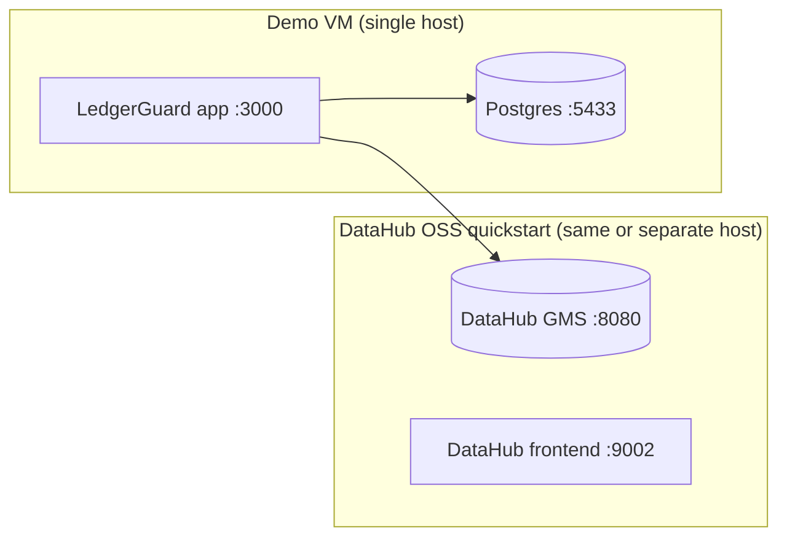

# Deployment

This describes a **hackathon-grade demo deployment**: one small VM, Docker,
synthetic data only. It is not a production-hardening guide, and it is
deliberately kept separate from — and does not touch — any Arvanta
infrastructure.

## Recommended architecture

- One dedicated demo VM. **Not** the Arvanta production server.
- Docker + Docker Compose available.
- DataHub OSS via its own official quickstart (`npm run datahub:up`), run as
  an independent stack — do not fold it into `docker-compose.demo.yml`.
- A reverse proxy / HTTPS termination in front of the app **only if one
  already exists** in your environment; this repository does not ship one,
  and none should be added speculatively.
- Demo-only synthetic data — never point `DATABASE_URL` at a real ERP
  database.

## Minimum demo VM sizing

| Resource | Minimum |
|---|---|
| vCPU | 4 |
| RAM | 16 GB (DataHub OSS alone recommends ~8 GB; the app + Postgres need headroom on top) |
| Disk | 25 GB free (DataHub OSS quickstart uses ~13 GB) |

## Docker requirements

- Docker Engine + Docker Compose v2 (`docker compose`, not the legacy
  `docker-compose` binary).
- Two independent compose projects run side by side on the same host without
  conflict:
  - `docker-compose.demo.yml` (this repo) — the app + its own Postgres.
  - The DataHub OSS quickstart's own compose project (managed entirely by the
    `datahub` CLI via `npm run datahub:up` / `datahub:down`).

## Ports

| Port | Service | Notes |
|---|---|---|
| 3000 | LedgerGuard app | May shift if occupied — check the container/process logs for the actual bound port |
| 5433 | Demo PostgreSQL | Mapped to avoid clashing with a local 5432 |
| 8080 | DataHub GMS | Never expose to the public internet without auth |
| 9002 | DataHub frontend | Optional, for browsing the DataHub UI directly |

## Environment variables

Copy [`.env.example`](../.env.example) to `.env` on the VM and fill in real
values there — never commit it. See the README's
[Environment variables](../README.md#environment-variables) section for the
required/optional split. No credentials are documented here.

## Startup order

1. Start Postgres (`docker compose -f docker-compose.demo.yml up -d postgres`,
   or `npm run db:up` for local dev).
2. Wait for Postgres health check to pass.
3. Run migrations and seed (`npm run db:migrate && npm run db:seed`).
4. Start DataHub OSS (`npm run datahub:up`), separately.
5. Wait for GMS health check to pass (`npm run datahub:status`).
6. Bootstrap DataHub metadata (`npm run datahub:bootstrap`).
7. Start/build the app (`docker compose -f docker-compose.demo.yml up -d app`,
   or `npm run dev` / `npm run build && npm start` for local).

## Health checks

- Postgres: `pg_isready` (already wired into both compose files).
- DataHub GMS: `npm run datahub:status`, or `curl http://localhost:8080/health`.
- App: the app's own HTTP root responding 200 (wired into
  `docker-compose.demo.yml`'s `app` health check).

## Backup / reset warning

`npm run db:reset` and `npm run db:nuke` are **destructive** against whatever
`DATABASE_URL` currently points at. Before running either on a shared demo VM,
confirm `DATABASE_URL` points at the demo database and not anything else.
There is no automated backup for the demo database — it is synthetic and
disposable by design; do not store anything in it you'd need to recover.

## Smoke-test checklist

1. `npm run datahub:status` reports healthy.
2. `curl -f http://localhost:8080/health` (or the VM's equivalent) returns OK.
3. `npm run test:datahub` passes against the live instance.
4. `npm run test:agent` passes against the live instance.
5. The app's root route returns 200.
6. `npm run scenario:conversion-error` followed by one full manual pass through
   the demo flow (see [`docs/ui/ledgerguard-demo-flow.md`](ui/ledgerguard-demo-flow.md))
   completes without error, including DataHub write-back.
7. `npm run db:reset` returns the demo to a healthy baseline.

## Common failures

| Symptom | Likely cause | Fix |
|---|---|---|
| App can't reach Postgres | `DATABASE_URL` host/port mismatch between container network and host mapping | Inside `docker-compose.demo.yml`, the app must use the `postgres` service name, not `localhost` |
| DataHub GMS never becomes healthy | Insufficient RAM/disk on the VM | Confirm the VM meets the sizing table above; DataHub OSS is resource-heavy by design |
| DataHub write-back fails but ERP fix looks applied | Expected, documented behavior — see [`docs/architecture/overview.md`](architecture/overview.md#6-datahub-dependency-and-failure-behavior) | Not a bug; the dataset's DataHub metadata is marked stale, the ERP-side correction stands |
| `datahub` CLI prints a Python-version warning | Running Python 3.12+ instead of the recommended 3.11 | Non-blocking; verified working on 3.13 in this project's own testing |
| Port 3000 already bound | Another process on the host | Next.js will bind the next free port automatically in `npm run dev`; for the Docker image, change the host-side port mapping in `docker-compose.demo.yml` |

## Deployment checklist

1. Clone the repository onto the demo VM.
2. Configure environment (`cp .env.example .env`, fill in real values).
3. Start Postgres and wait for its health check.
4. Start DataHub OSS via its own quickstart (`npm run datahub:up`).
5. Verify GMS health (`npm run datahub:status`).
6. Bootstrap DataHub metadata (`npm run datahub:bootstrap`).
7. Build and start the Next.js app (Docker: `docker compose -f docker-compose.demo.yml up -d --build`).
8. Run the database seed (`npm run db:seed`, already part of `db:setup`/migration flow).
9. Run smoke tests (see checklist above).
10. Verify reset works (`npm run db:reset`, confirm it returns to the healthy baseline).
11. Verify DataHub write-back works (run the demo flow once, confirm the
    dataset's DataHub tag/notes update after a verified remediation).
12. Capture the final URLs (app, DataHub frontend if exposed) for the
    submission draft ([`docs/submission.md`](submission.md)).
